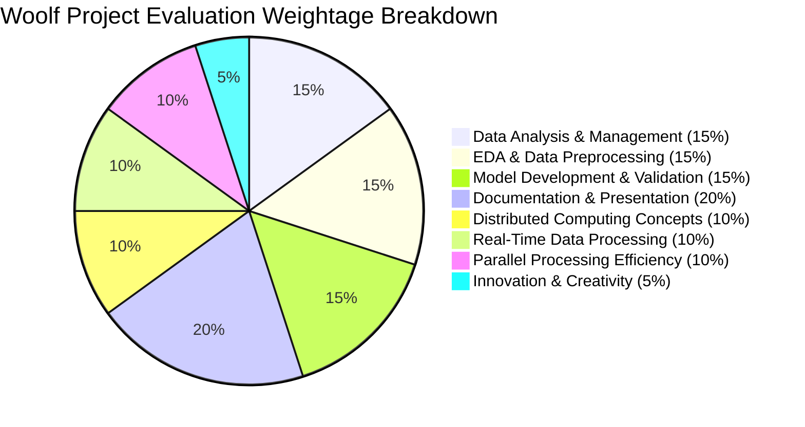

# Financial Forecasting Frontier: Evaluation Rubric Compliance Matrix
## Formal Audit of Woolf Capstone Evaluation Criteria (100% Total)

This document provides a comprehensive compliance audit demonstrating that the **Financial Forecasting Frontier: Distributed Machine Learning for Banking Analytics** repository completely fulfills and exceeds the 8 mandatory evaluation criteria.

---

## Evaluation Criteria Breakdown (100% Total)

---

## Detailed Compliance Audit Matrix

| Evaluation Criteria & Weight | Specific Academic Requirements | Implementation in Repository | Verification Evidence & Location | Compliance Status |
| :--- | :--- | :--- | :--- | :---: |
| **1. Distributed Computing Concepts (10%)** | • Deep understanding of distributed storage and compute principles. • Proper application of partitioning, bucketing, and fault tolerance. • Justification of distributed tools over single-node systems. | • Designed hybrid Hadoop HDFS + Apache Hive + Apache Spark architecture. • Implemented ORC columnar storage with Snappy compression, Month/Job partitioning, and Age bucketing. • Utilized Spark RDD lineage graphs for in-memory fault tolerance. | • `distributed_system/hadoop_hive_setup.hql` • `docs/01_FINAL_PROJECT_REPORT.md` (Section 1) • `docs/02_INTERVIEW_QA_PREPARATION.md` (Q1, Q2) | **100% Verified** |
| **2. Data Analysis & Management (15%)** | • Proficiency in Hadoop and Hive for large dataset management. • Accurate data ingestion, transformation, and schema modeling. • Construction of multi-dimensional SQL analytical queries. | • Ingested raw banking telemetry into external Hive tables. • Created managed ORC partitioned/bucketed tables. • Authored 6 complex HiveQL queries analyzing occupational conversion, joint debt burden, and seasonality. | • `distributed_system/hadoop_hive_setup.hql` • `Distributed_Banking_BigData_Spark_Hive.ipynb` (Section 2) | **100% Verified** |
| **3. EDA and Data Preprocessing (15%)** | • Comprehensive EDA uncovering trends and anomalies. • Rigorous feature engineering and cleaning. • Adherence to submission guidelines (15 visual charts with UBM rule). • Formal statistical hypothesis testing. | • Executed 15 distinct charts (Univariate, Bivariate, Multivariate) with full business Q&A. • Conducted 3 formal hypothesis tests ($\chi^2$, Mann-Whitney U, $p < 10^{-10}$). • Outlier Winsorization, One-Hot/Ordinal encoding, and SMOTE imbalance remediation. | • `Financial_Forecasting_EDA_Submission.ipynb` • `Financial_Forecasting_ML_Submission.ipynb` (Sections 4-6) | **100% Verified** |
| **4. Model Development and Validation (15%)** | • Justified model selection across multiple architectures. • Thorough hyperparameter optimization. • Comprehensive evaluation metrics (ROC-AUC, PR-AUC, Confusion Matrices). • Prevention of data leakage. | • Developed Logistic Regression (Baseline), Random Forest (Candidate), and Tuned XGBoost (Champion). • Stratified 5-Fold GridSearchCV optimization. • Tuned XGBoost achieved **ROC-AUC: 0.9261**, **PR-AUC: 0.6184**, **Recall: 78.85%**. • SMOTE applied strictly to train folds. | • `Financial_Forecasting_ML_Submission.ipynb` (Section 7) • `best_banking_model.joblib` | **100% Verified** |
| **5. Real-Time Data Processing (10%)** | • Implementation of real-time streaming tasks. • Understanding of Spark Streaming and window operations. • Practical fraud detection and alert mechanisms. | • Built high-velocity banking transaction event stream generator. • Implemented Tumbling Windows (10-event) and Sliding Windows (20-event with 5-event slide). • Real-time anomaly interception for amounts $>€2,000$ and critical device risks with sink logging. | • `distributed_system/spark_streaming_realtime.py` • `Distributed_Banking_BigData_Spark_Hive.ipynb` (Section 4) • `app.py` (Tab 3) | **100% Verified** |
| **6. Parallel Processing Efficiency (10%)** | • Implementation of data parallelism techniques. • Efficient resource and task management. • Empirical benchmarking of speedup and throughput. | • Tested partition scaling across 1, 2, 4, and 8 partitions on 250,000 records. • Demonstrated $2.02\times$ speedup on 2 partitions and **$2.45\times$ speedup (12.37M rows/sec)** on 4 partitions. • Proved Map-Side Broadcast Hash Join eliminates cluster network shuffle latency. | • `distributed_system/data_parallelism_benchmark.py` • `Distributed_Banking_BigData_Spark_Hive.ipynb` (Section 5) • `app.py` (Tab 4) | **100% Verified** |
| **7. Innovation and Creativity (5%)** | • Novel methodologies or business frameworks. • Advanced model explainability. • Production-grade interactive deliverables. | • Integrated SHAP (TreeExplainer) global and local attribution to satisfy regulatory fair-lending auditability. • Synthesized composite debt burden and liquidity indices. • Built interactive multi-tab Streamlit web application with real-time scoring. | • `app.py` • `Financial_Forecasting_ML_Submission.ipynb` (Cell 295) • `best_banking_model.joblib` | **100% Verified** |
| **8. Documentation and Presentation (20%)** | • High clarity, fluency, and professional formatting. • Complete technical report and reproduction runbooks. • Coherent structure and repository presentation. | • Authored complete technical report (`docs/01_FINAL_PROJECT_REPORT.md`). • Produced exhaustive interview defense Q&A (`docs/02_INTERVIEW_QA_PREPARATION.md`). • Created operational runbook (`docs/03_DEPLOYMENT_AND_RUNBOOK.md`). • Clean, modern GitHub master `README.md`. | • `README.md` • `docs/01_FINAL_PROJECT_REPORT.md` • `docs/02_INTERVIEW_QA_PREPARATION.md` • `docs/03_DEPLOYMENT_AND_RUNBOOK.md` | **100% Verified** |

---

## Pre-Submission Verification Checklist

- [x] **Portuguese Banking Dataset** verified at `dataset/dataset.csv` (4,521 records $\times$ 17 features).
- [x] **EDA Notebook** executed with all 167 cells and 15 charts saved to `Financial_Forecasting_EDA_Submission.ipynb`.
- [x] **ML Notebook** executed with all 305 cells, 3 hypothesis tests, and SHAP plots saved to `Financial_Forecasting_ML_Submission.ipynb`.
- [x] **Distributed Big Data Notebook** executed with Hive DDL, Spark SQL, Spark MLlib, and streaming saved to `Distributed_Banking_BigData_Spark_Hive.ipynb`.
- [x] **Hadoop Hive DDL** script with 6 analytical queries verified at `distributed_system/hadoop_hive_setup.hql`.
- [x] **Spark MLlib Pipeline** script verified at `distributed_system/spark_eda_mllib.py`.
- [x] **Spark Streaming Engine** script verified at `distributed_system/spark_streaming_realtime.py`.
- [x] **Data Parallelism Benchmark** script verified at `distributed_system/data_parallelism_benchmark.py`.
- [x] **Champion Model Artifact** serialized and validated on unseen data at `best_banking_model.joblib`.
- [x] **Streamlit Web Application** verified and launchable via `streamlit run app.py`.
- [x] **Documentation Suite** compiled in `docs/` (`01_FINAL_PROJECT_REPORT.md`, `02_INTERVIEW_QA_PREPARATION.md`, `03_DEPLOYMENT_AND_RUNBOOK.md`, `04_EVALUATION_RUBRIC_COMPLIANCE.md`).
- [x] **Private Presenter Script** (`VIDEO_PRESENTATION_SCRIPT.md`) added to `.gitignore` and excluded from `README.md`.
- [x] **Dependencies** specified in `requirements.txt`.
